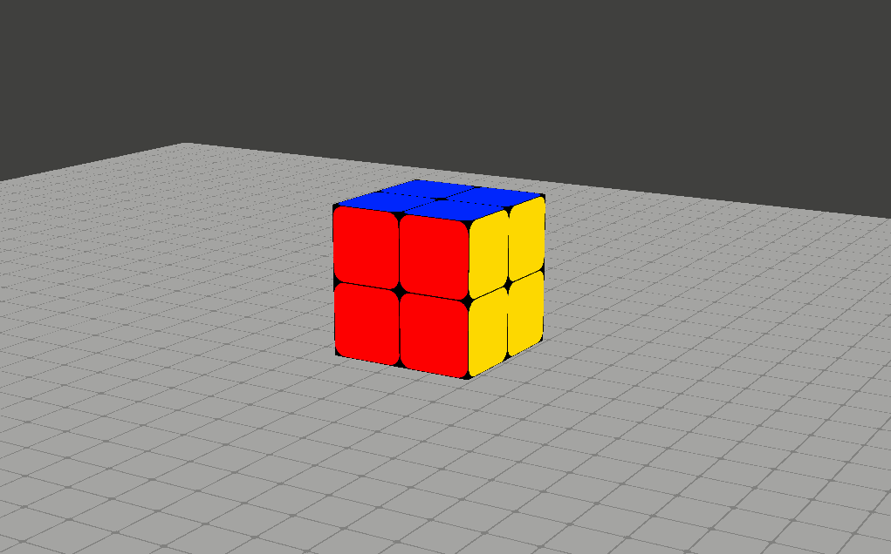

# Solving Rubik’s with Search Algorithms
This is a project to solve the 2x2 Rubik's cube using different search algorithms(ID-DFS, A*, Bi-BFS).
To run the game environment in manual state use "python main.py --manual" command. You can change the camera angle by holding the right click and moving the mouse and also rotate the faces of the Rubik's cube with the keys 1 to 6 and q to y.

    

